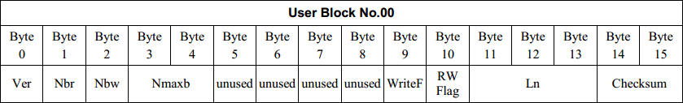

******************
Generate Test Tags
******************

This page contains instructions to generate tags for testing reader
compliance with NFC Forum Tag Type, NDEF and RTD specifications. The
tools used are in the ``examples`` directory.

Type 3 Tags
===========

Attribute Block Tests
---------------------

This is a collection of tags to test processing of the the Type 3 Tag
attribute information block. These can be used to verify if the NFC
device correctly reads or writes tags with different attribute
information, both valid and invalid. Below figure (from the NFC Forum
Type 3 Tag Operation Specification) shows the Attribute Information
Format.

TT3_READ_BV_001
^^^^^^^^^^^^^^^

::

   $ ./tagtool.py format
   $ ./ndeftool.py make smartposter http://nfcpy.readthedocs.org/ -t "nfcpy documentation hosted on readthedocs" | ./tagtool.py load -
   $ ./tagtool.py format tt3 --len 80 --max 5 --rw 0

* Settings: Len = Nmaxb * 16, RWFlag = 0x00
* Expected: Fully used tag. Read all data stored (Len)

TT3_READ_BV_002
^^^^^^^^^^^^^^^

::

   $ ./tagtool.py format
   $ ./ndeftool.py make smartposter http://nfcpy.readthedocs.org/ -t "nfcpy documentation" | ./tagtool.py load -
   $ ./tagtool.py format tt3 --len 58 --rw 0 --nbr 1

* Settings: Nbr = 1, RWFlag = 0x00
* Expected: Identify as „Read Only“ (normal read-only tag, read only 1
  block at a time)

TT3_READ_BV_003
^^^^^^^^^^^^^^^

::

   $ ./tagtool.py format
   $ ./ndeftool.py make smartposter http://nfcpy.readthedocs.org/ -t "nfcpy documentation" | ./tagtool.py load -
   $ ./tagtool.py format tt3 --len 58 --rw 0 --max 3

* Nbr > Nbmax, RWFlag = 0x00
* Read Nbmax blocks (NOT read Nbr blocks)

TT3_READ_BV_004
^^^^^^^^^^^^^^^

::

   $ ./tagtool.py format
   $ ./ndeftool.py make smartposter http://nfcpy.readthedocs.org/ -t "nfcpy documentation" | ./tagtool.py load -
   $ ./tagtool.py format tt3 --len 58 --rw 0 --wf 15

* WriteFlag = 0x0F, RWFlag = 0x00
* Identify as „corrupted data“ (previous write interrupted)

TT3_READ_BV_005
^^^^^^^^^^^^^^^

::

   $ ./tagtool.py format
   $ ./ndeftool.py make smartposter http://nfcpy.readthedocs.org/ -t "nfcpy documentation" | ./tagtool.py load -
   $ ./tagtool.py format tt3 --len 58 --rw 0 --max 3

* Nmaxb * 16 < Len, RWFlag = 0x00
* Identify as „Corrupted data“ (invalid length)

TT3_READ_BV_006
^^^^^^^^^^^^^^^

::

   $ ./tagtool.py format
   $ ./ndeftool.py make smartposter http://nfcpy.readthedocs.org/ -t `python -c 'print(810*"nfcpy")'` | ./tagtool.py load -
   $ ./tagtool.py format tt3 --len 4495 --rw 0

* Nmaxb > 255, Len > 255, RWFlag = 0x00
* Read all data. Identify as „Read Only“. Write prohibited. (normal
  read-only tag)
* Requires a tag with more than 4 kbyte NDEF capacity

TT3_READ_BI_001
^^^^^^^^^^^^^^^

::

   $ ./tagtool.py format
   $ ./ndeftool.py make smartposter http://nfcpy.readthedocs.org/ -t "nfcpy documentation" | ./tagtool.py load -
   $ ./tagtool.py format tt3 --len 58 --rw 0 --nbr 0 --nbw 0

* Nbr = 0, Nbw = 0, RWFlag = 0x00
* Identify as „Corrupted data“ (invalid attribute information block)

TT3_READ_BI_002
^^^^^^^^^^^^^^^

::

   $ ./tagtool.py format
   $ ./ndeftool.py make smartposter http://nfcpy.readthedocs.org/ -t "nfcpy documentation" | ./tagtool.py load -
   $ ./tagtool.py format tt3 --len 58 --rw 0 --crc 4660

* Checksum invalid, RWFlag = 0x00
* Identify as „Corrupted data“ (invalid attribute information block)

TT3_READ_BI_003
^^^^^^^^^^^^^^^

::

   $ ./tagtool.py format
   $ ./ndeftool.py make smartposter http://nfcpy.readthedocs.org/ -t "nfcpy documentation" | ./tagtool.py load -
   $ ./tagtool.py format tt3 --len 58 --rw 0 --ver 2.0

* Version = 2.0, RWFlag = 0x00
* Identify as unknown version

TT3_READ_BI_004
^^^^^^^^^^^^^^^

::

   $ ./tagtool.py format
   $ ./ndeftool.py make smartposter http://nfcpy.readthedocs.org/ -t "nfcpy documentation" | ./tagtool.py load -
   $ ./tagtool.py format tt3 --len 58 --rw 0 --rfu 255

* All unused bytes in attribute block = 0xFF
* Ignore when reading RWFlag = 0x00 

TT3_WRITE_BV_001
^^^^^^^^^^^^^^^^

::

   $ ./tagtool.py format tt3 --rw 0

* RWFlag = 0x00, no content
* Identify as „Read Only“. Write prohibited. (normal read-only tag)

TT3_WRITE_BV_002
^^^^^^^^^^^^^^^^

::

   $ ./tagtool.py format tt3 --rw 1

* RWFlag = 0x01, no content
* Identify as „Read/Write“. Write permitted. (normal writtable tag)

TT3_WRITE_BV_003
^^^^^^^^^^^^^^^^

::

   $ ./tagtool.py format tt3 --rw 0 --max 4

* Nbw > Nbmax, RWFlag = 0x01
* Write Nbmax blocks (**not** write Nbw blocks)
