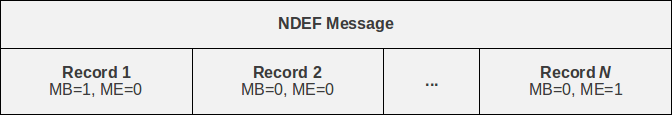

.. _ndef-tutorial:

************************
NFC Data Exchange Format
************************

NDEF (NFC Data Exchange Format) is a binary message format to exchange
application-defined payloads between NFC Forum Devices or to store
payloads on an NFC Forum Tag. A payload is described by a type, a
length and an optional identifer encoded in an NDEF record
structure. An NDEF message is a sequence of NDEF records with a begin
marker in the first and an end marker in the last record.

NDEF decoding and encoding is provided by the :mod:`nfc.ndef` module.

>>> import nfc.ndef

Parsing NDEF
============

An :class:`nfc.ndef.Message` class can be initialized with an NDEF
message octet string to parse that data into the sequence of NDEF
records framed by the begin and end marker of the first and last
record. Each NDEF record is represented by an :class:`nfc.ndef.Record`
object accessible through indexing or iteration over the
:class:`nfc.ndef.Message` object.

>>> import nfc.ndef
>>> message = nfc.ndef.Message(b'\xD1\x01\x0ET\x02enHello World')
>>> message
nfc.ndef.Message([nfc.ndef.Record('urn:nfc:wkt:T', '', '\x02enHello World')])
>>> len(message)
1
>>> message[0]
nfc.ndef.Record('urn:nfc:wkt:T', '', '\x02enHello World')
>>> for record in message:
>>>     record.type, record.name, record.data
>>> 
('urn:nfc:wkt:T', '', '\x02enHello World')

An NDEF record carries three parameters for describing its payload:
the payload length, the payload type, and an optional payload
identifier. The :attr:`nfc.ndef.Record.data` attribute provides access
to the payload and the payload length is obtained by :func:`len`. The
:attr:`nfc.ndef.Record.name` attribute holds the payload identifier
and is an empty string if no identifer was present in the NDEF
date. The :attr:`nfc.ndef.Record.type` identifies the type of the
payload as a combination of the NDEF Type Name Format (TNF) field and
the type name itself.

*Empty (TNF 0)*

  An *Empty* record type (expressed as a zero-length string) indicates
  that there is no type or payload associated with this
  record. Encoding a record of this type will exclude the name
  (*payload identifier*) and data (*payload*) contents. This type can
  be used whenever an empty record is needed; for example, to
  terminate an NDEF message in cases where there is no payload defined
  by the user application.

*NFC Forum Well Known Type (TNF 1)*

  An *NFC Forum Well Known Type* is a URN as defined by :rfc:`2141`,
  with the namespace identifier (NID) "nfc". The Namespace Specific
  String (NSS) of the NFC Well Known Type URN is prefixed with
  "wkt:". When encoded in an NDEF message, the Well Known Type is
  written as a relative-URI construct (cf. :rfc:`3986`), omitting the NID
  and the “wkt:” -prefix. For example, the type “urn:nfc:wkt:T” will
  be encoded as TNF 1, TYPE "T".

*Media-type as defined in RFC 2046 (TNF 2)*

  A *media-type* follows the media-type BNF construct defined by
  :rfc:`2046`. Records that carry a payload with an existing,
  registered media type should use this record type. Note that the
  record type indicates the type of the payload; it does not refer to
  a MIME message that contains an entity of the given type. For
  example, the media type 'image/jpeg' indicates that the payload is
  an image in JPEG format using JFIF encoding as defined by
  :rfc:`2046`.

*Absolute URI as defined in RFC 3986 (TNF 3)*

  An *absolute-URI* follows the absolute-URI BNF construct defined by
  :rfc:`3986`. This type can be used for message types that are
  defined by URIs. For example, records that carry a payload with an
  XML-based message type may use the XML namespace identifier of the
  root element as the record type, like a SOAP/1.1 message may be
  represented by the URI 'http://schemas.xmlsoap.org/soap/envelope/'.

*NFC Forum External Type (TNF 4)*

  An *NFC Forum External Type* is a URN as defined by :rfc:`2141`,
  with the namespace identifier (NID) "nfc". The Namespace Specific
  String (NSS) of the NFC Well Known Type URN is prefixed with
  "ext:". When encoded in an NDEF message, the External Type is
  written as a relative-URI construct (cf. :rfc:`3986`), omitting the
  NID and the “ext:” -prefix. For example, the type
  “urn:nfc:ext:nfcpy.org:T” will be encoded as TNF 4, TYPE
  "nfcpy.org:T".

*Unknown (TNF 5)*

  An *Unknown* record type (expressed by the string "unknown")
  indicates that the type of the payload is unknown, similar to the
  “application/octet-stream” media type.

*Unchanged (TNF 6)*

  An *Unchanged* record type (expressed by the string "unchanged") is
  used in middle record chunks and the terminating record chunk used
  in chunked payloads. This type is not allowed in any other record.

>>> import nfc.ndef
>>> message = nfc.ndef.Message('\xD0\x00\x00')
>>> nfc.ndef.Message('\xD0\x00\x00')[0].type
''
>>> nfc.ndef.Message('\xD1\x01\x00T')[0].type
'urn:nfc:wkt:T'
>>> nfc.ndef.Message('\xD2\x0A\x00text/plain')[0].type
'text/plain'
>>> nfc.ndef.Message('\xD3\x16\x00http://example.org/dtd')[0].type
'http://example.org/dtd'
>>> nfc.ndef.Message('\xD4\x10\x00example.org:Text')[0].type
'urn:nfc:ext:example.org:Text'
>>> nfc.ndef.Message('\xD5\x00\x00')[0].type
'unknown'
>>> nfc.ndef.Message('\xD6\x00\x00')[0].type
'unchanged'

The type and name of the first record, by convention, provide the
processing context and identification not only for the first record
but for the whole NDEF message. The :attr:`nfc.ndef.Message.type` and
:attr:`nfc.ndef.Message.name` attributes map to the type and name
attributes of the first record in the message.

>>> message = nfc.ndef.Message(b'\xD1\x01\x0ET\x02enHello World')
>>> message.type, message.name
('urn:nfc:wkt:T', '')

If invalid or insufficient data is provided to the NDEF message parser, an :class:`nfc.ndef.FormatError` or :class:`nfc.ndef.LengthError` is raised.

>>> try: nfc.ndef.Message('\xD0\x01\x00')
... except nfc.ndef.LengthError as e: print e
... 
insufficient data to parse
>>> try: nfc.ndef.Message('\xD0\x01\x00T')
... except nfc.ndef.FormatError as e: print e
... 
ndef type name format 0 doesn't allow a type string

Creating NDEF
=============

An :class:`nfc.ndef.Record` class can be initialized with an NDEF

To build NDEF messages use the :class:`nfc.ndef.Record` class to
create records and instantiate an :class:`nfc.ndef.Message` object
with the records as arguments.

>>> import nfc.ndef
>>> record1 = nfc.ndef.Record("urn:nfc:wkt:T", "id1", "\x02enHello World!")
>>> record2 = nfc.ndef.Record("urn:nfc:wkt:T", "id2", "\x02deHallo Welt!")
>>> message = nfc.ndef.Message(record1, record2)

The :class:`nfc.ndef.Message` class also accepts a list of records as a single argument and it is possible to :meth:`nfc.ndef.Message.append` records or :meth:`nfc.ndef.Message.extend` a message with a list of records.

>>> message = nfc.ndef.Message()
>>> message.append(record1)
>>> message.extend([record2, record3])

The serialized form of an :class:`nfc.ndef.Message` object is produced with :func:`str`.

>>> message = nfc.ndef.Message(record1, record2)
>>> str(message)
'\x99\x01\x0f\x03Tid1\x02enHello World!Y\x01\x0e\x03Tid2\x02deHallo Welt!'

Specific Records
================

Text Record
-----------

>>> import nfc.ndef
>>> record = nfc.ndef.TextRecord("Hello World!")
>>> print record.pretty()
text     = Hello World!
language = en
encoding = UTF-8

Uri Record
----------

>>> import nfc.ndef
>>> record = nfc.ndef.UriRecord("http://nfcpy.org")
>>> print record.pretty()
uri = http://nfcpy.org

Smart Poster Record
-------------------

>>> import nfc.ndef
>>> uri = "https://launchpad.net/nfcpy"
>>> record = nfc.ndef.SmartPosterRecord(uri)
>>> record.title = "Python module for near field communication"
>>> record.title['de'] = "Python Modul für Nahfeldkommunikation"
>>> print record.pretty()
resource  = https://launchpad.net/nfcpy
title[de] = Python Modul für Nahfeldkommunikation
title[en] = Python module for near field communication
action    = default
